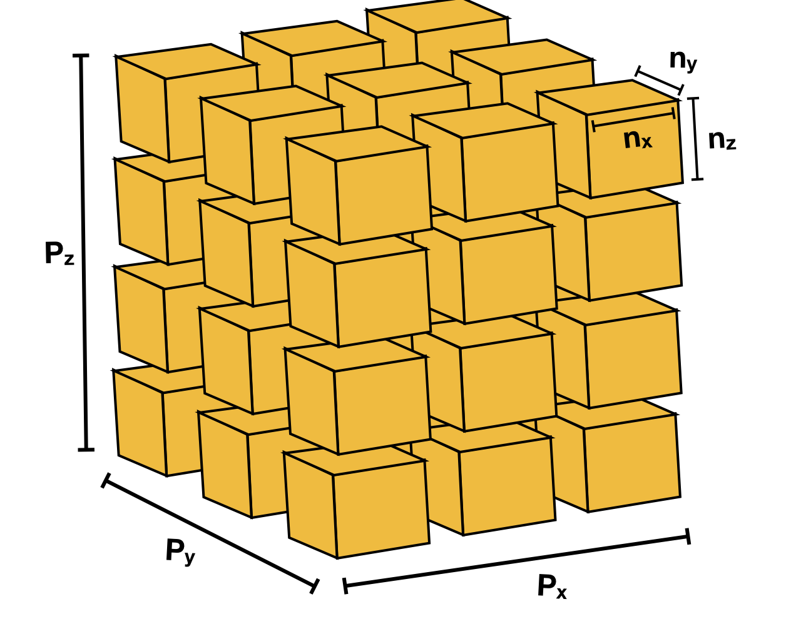
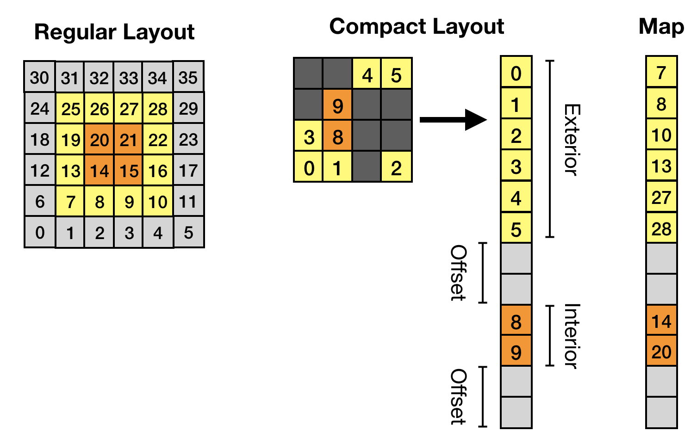
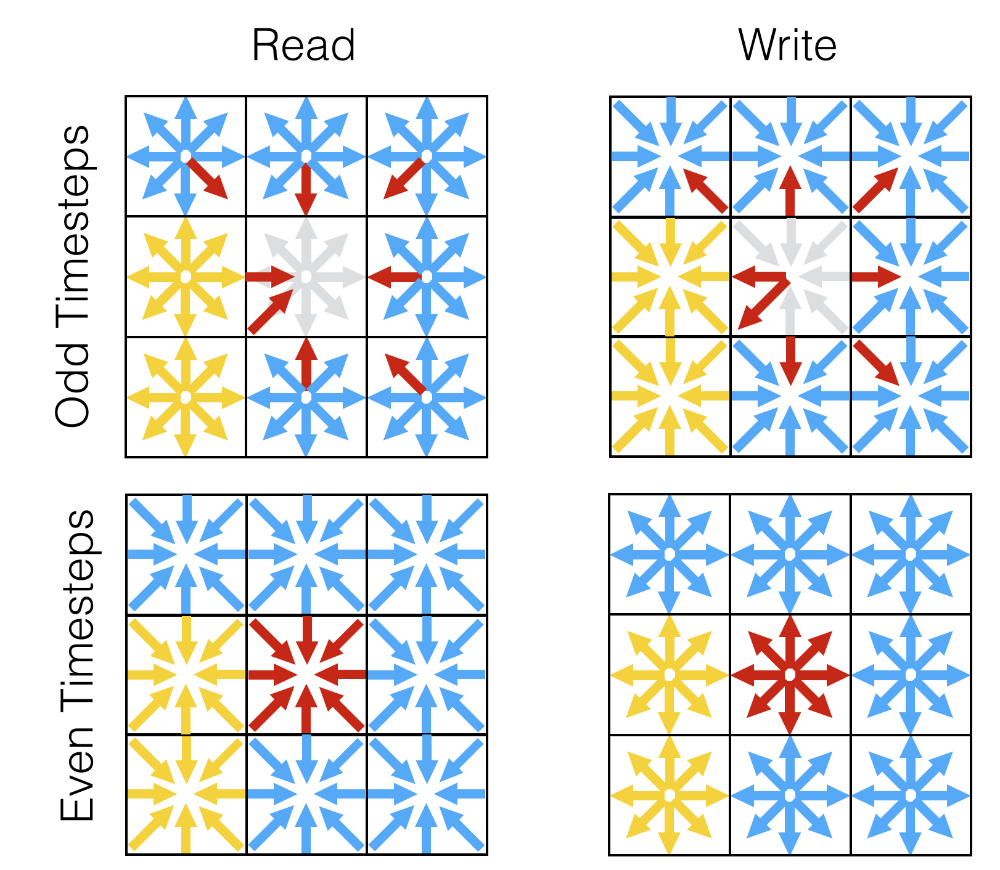

===============
Data Structures
===============

LBPM includes a variety of generalized data structures to facilitate the implementation
of different lattice Boltzmann models. These core data structures are designed so that
they are agnostic to the particular physics of a model. Many different lattice Boltzmann
schemes can be constructed using the same basic data structures. The core data structures
are primarily designed to

1) prepare 3D image data for distributed memory simulation based on MPI
2) develop common data structures to facilitate the local streaming step
3) generate and store information needed to exchange data between MPI processes
4) develop common routines for parallel communication for lattice Boltzmann methods.

By using the core data structures, it is possible to develop new physical models
without having to revisit the data structures or parallel algorithms on which a model is
built. Understanding and using the core data structures is very useful if you intend
to build new physical models within LBPM. In most cases, only the collision step
will need to be developed to implement a particular physical model. 

------------------
Domain
------------------

The ``Domain`` data structure includes information needed to carry out generic
parallel computations on 3D image data. LBPM is designed to support parallel
simulation where the image data is distributed over a potentially large number of
processors. Each processor recieves an equal size chunk of the input image,
which is specified based on the input database file in the form ``n = nx, ny, nz``.
The total image size is specified as ``N = Nx, Ny, Nz``, which is needed to read
the input image. In the typical case, the input image data will be read only by MPI
rank 0, and sub-domains will be assigned and distributed to each MPI process.
The regular process grid is specified as ``nproc = Px, Py, Pz``. If the entire image
is to be distributed across the processors, the values must be chosen such that
``Nx = nx*Px``, ``Ny = ny*Py`` and ``Nz = nz*Pz``. The basic purpose for the
data structures contained in the ``Domain`` class is to retain basic information
about the domain structure to support parallel computations in MPI. Code within the
``analysis/`` directory will generally rely on these data structures to determine
how to perform computations in parallel. For GPU-based application,  information
contained within the ``Domain`` structure is usually retained only the CPU.
Lattice Boltzmann algorithms rely on dedicated data structures within the ``ScaLBL``
class to perform MPI computations, which are designed for these applications
specifically.

    Domain decomposition used by LBPM to distribute 3D image data across processors.
    Each processor recieves an equal size block of the input image. The Domain class
    organizes MPI communications with adjacent blocks based on the processor layout.

------------------
ScaLBL
------------------   

While the ``Domain`` data structures retain essential information needed to
carry out generic types of computations based on regular 3D image files,
``ScaLBL`` data structures are designed specifically for lattice Boltzmann methods.
The main purposes for these data structures are to:

1) allow for overlap between computations that do not depend on MPI communication and the
   MPI communications required by LBMs (e.g. to carry out the streaming step, perform
   halo exchanges, etc.)
2) reduce the computational and memory requirements by excluding image sites where flow
   does not occur; and
3) to facilitate efficient data access patterns based on the memory layout used by
   data structures.

These are critical steps to provide good parallel performance and make efficient use
of GPUs. 

In many cases flow will occur only in a fraction of the voxels from the original 3D input
image. Since LBM schemes store a lot of data for each active voxels (e.g. 19 double precision
values for a single D3Q19 model), significant memory savings can be realized by excluding
immobile voxels from the data structure. Furthermore, it is useful to distiguish between
the interior lattice sites (which do not require MPI communications to update) and the exterior
lattice sites (which must wait for MPI communications to complete before the local update can
be completed). Within LBPM it is almost always advantageous to overlap interior computations with
MPI communications, so that the latter costs can be hidden behind the computational density
of the main lattice Boltzmann kernels. As the local sub-domain size increases, the number of
interior sites will tend to be significantly larger than the number of exterior sites. 
The data layout is summarized in the image below.

	   Data structure used by ScaLBL to support lattice Boltzmann methods.
	   Regions of the input image that are occupied by solid are excluded.
	   Interior and exterior lattice sites are stored separately so that
	   computations can efficiently overlap with MPI communication.

Another factor in the data structure design are the underlying algorithms used by the LBM
to carry out the streaming step. There are at least a half dozen distinct algorithms that
can be used to perform streaming for lattice Boltzmann methods, each with their own advantages
and disadvantages. Generally, the choice of streaming algorithm should reduce the overall memory
footprint while also avoiding unnecessary memory accesses. LBPM uses the AA algorithm so
that a single array is needed to perform the streaming step. The AA algorithm relies on the symmetry
of the discrete velocity set used by LBMs to implement an efficient algorithm. Conceptually,
we can easily see that for each distribution that needs to be accessed to perform streaming,
there is an opposite distribution. The AA algorithm proceeds by identifying these distributions
and exchanging their storage locations in memory, as depicted in the image below. The data
access pattern will therefore alternate between even and odd timesteps. Within LBPM, a ``NeighborList``
is constructed to store the memory location for the accompanying pair for each distribution.
If the neighboring site is in the solid, the neighbor is specified such that the halfway
bounceback rule will applied automatically. In this way, the streaming step can be performed
very efficiently on either GPU or CPU.

	   

           Data access pattern for AA streaming algorithm used by LBPM. The location to read
	   and write distributions alternates between even and odd timesteps. A solid bounceback
	   rule is built into the data structure.
