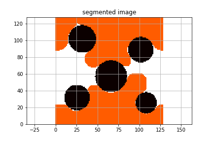

*****************************
Morphological pre-processors
*****************************

LBPM includes morphological pre-processing tools as utility functions.
It is often useful to generate initial conditions for a 2-phase flow simulation based on a morphological approach. In particular, morphological tools can be used to provide a physical reasonable initial condition in cases where direct experimental observations are not available. These initial configurations are compatible with any of the 2-phase simulation protocols used by lbpm_color_simulator. These initialization approaches alter the fluid labels within the input files, writing a new file with the new morphologically assigned labels.

There are two main morphological pre-processors in LBPM

* ``lbpm_morphdrain_pp`` -- initialize fluid configuration based on morphological drainage
* ``lbpm_morphopen_pp`` -- initialize fluid configuration based on morphological opening

Here we demonstrate ``lbpm_morphdrain_pp`` because it offers the most information. Although it is not perfect, the morphological drainage operation does a good job of approximating configurations observed along primary drainage processes performed under water-wet conditions. A limitation is that fluid trapped in the corners will not stop the morphological operation from eroding it. This should not discourage you too much -- morphological tools are very practical and can save you a lot of time! It is also a good thing to be skeptical.

Since the morphological operation works on the input domain, associated parameters are added to the ``Domain`` section of the input file. Here we will set a target saturation Sw = 0.20, which will run the morphological drainage operation until the fluid labeled as 2 occupies 20% of the pore space or less. For the case considered in
``example/DiscPack`` we specify the following information in the input file

.. code:: c

	  Domain {
	     Filename = "discs_3x128x128.raw"
	     ReadType = "8bit"    // data type
	     N = 3, 128, 128       // size of original image
	     nproc = 1, 2, 2       // process grid
	     n = 3, 64, 64         // sub-domain size
	     voxel_length = 1.0    // voxel length (in microns)
	     ReadValues = 0, 1, 2  // labels within the original image
	     WriteValues = 0, 2, 2 // associated labels to be used by LBPM
	     BC = 0                // fully periodic BC
	     Sw = 0.35             // target saturation for morphological tools
	  }

Once this has been set, we launch lbpm_morphdrain_pp in the same way as other parallel tools

.. code:: bash

	  mpirun -np 4 $LBPM_BIN/lbpm_morphdrain_pp input.db

Successful output looks like the following

.. code:: bash

	  Performing morphological opening with target saturation 0.350000 
	  voxel length = 1.000000 micron 
	  voxel length = 1.000000 micron 
	  Input media: discs_3x128x128.raw
	  Relabeling 3 values
	  oldvalue=0, newvalue =0 
	  oldvalue=1, newvalue =2 
	  oldvalue=2, newvalue =2 
	  Dimensions of segmented image: 3 x 128 x 128 
	  Reading 8-bit input data 
	  Read segmented data from discs_3x128x128.raw 
	  Label=0, Count=11862 
	  Label=1, Count=37290 
	  Label=2, Count=0 
	  Distributing subdomains across 4 processors 
	  Process grid: 1 x 2 x 2 
	  Subdomain size: 3 x 64 x 64 
	  Size of transition region: 0 
	  Media porosity = 0.758667 
	  Initialized solid phase -- Converting to Signed Distance function 
	  Volume fraction for morphological opening: 0.758667 
	  Maximum pore size: 116.773801 
	     1.000000      110.935111
	     1.000000      105.388355
	     1.000000      100.118937
	     1.000000      95.112990
	     1.000000      90.357341
	     1.000000      85.839474
	     1.000000      81.547500
	     1.000000      77.470125
	     1.000000      73.596619
	     1.000000      69.916788
	     1.000000      66.420949
	     1.000000      63.099901
	     1.000000      59.944906
	     1.000000      56.947661
	     1.000000      54.100278
	     1.000000      51.395264
	     1.000000      48.825501
	     1.000000      46.384226
	     1.000000      44.065014
	     1.000000      41.861764
	     1.000000      39.768675
	     1.000000      37.780242
	     1.000000      35.891230
	     1.000000      34.096668
	     1.000000      32.391835
	     0.575114      30.772243
	     0.433119      29.233631
	     0.291231      27.771949
	  Final void fraction =0.291231
	  Final critical radius=27.771949
	  Writing ID file 
	  Writing file to: discs_3x128x128.raw.morphdrain.raw

The final configuration can be visualized in python by loading the output file
``discs_3x128x128.raw.morphdrain.raw``.

    Fluid configuration resulting from orphological drainage algorithm applied to a 2D disc pack.

