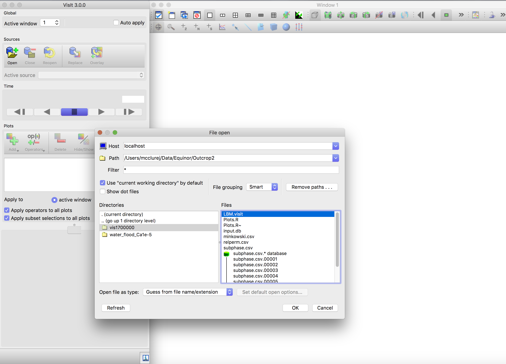
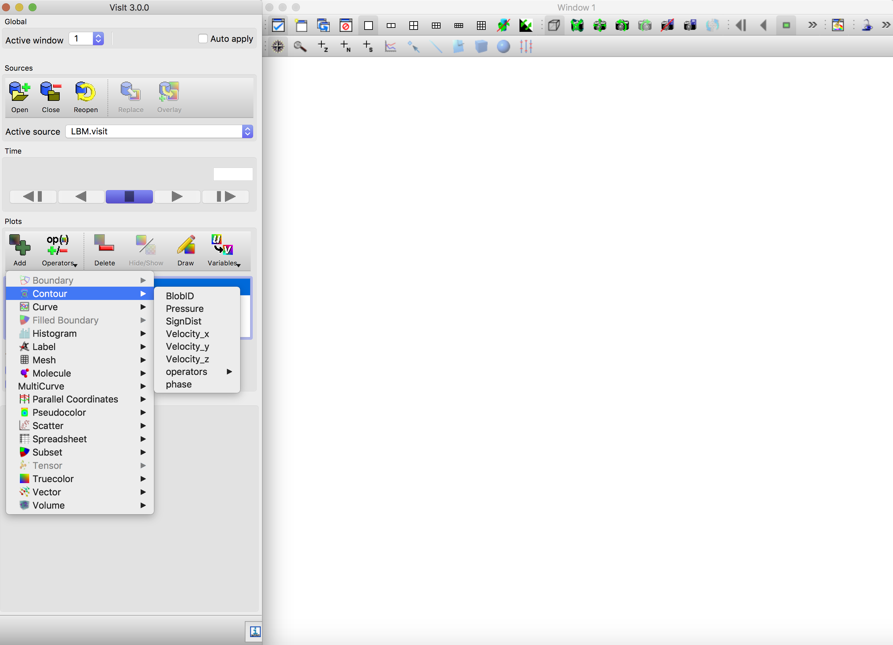
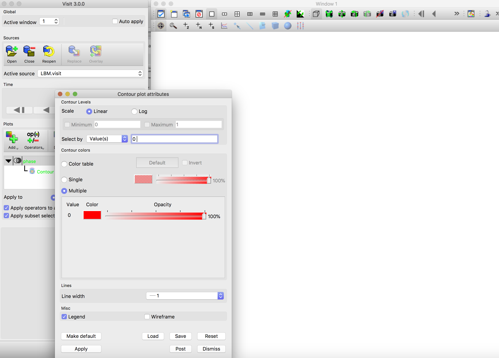
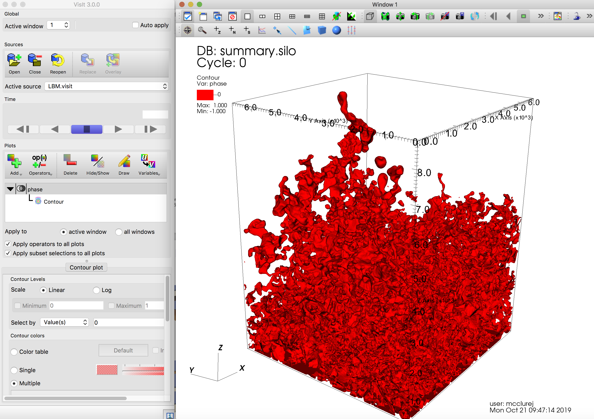

======================================
Visualizing simulation data with visit
======================================

(Paraview > v 5.6 also works)

Control over visualization options is set within the ``Visualization`` section of the input file

.. code:: c

   Visualization {
      write_silo = true     // write SILO databases with assigned variables
      save_8bit_raw = true  // write labeled 8-bit binary files with phase assignments
      save_phase_field = true  // save phase field within SILO database
      save_pressure = false    // save pressure field within SILO database
      save_velocity = false    // save velocity field within SILO database
   }

LBPM provides two main options for visualization. The first is the writing of 8-bit raw binary files, which are labeled based on the timestep. For example, if ``visualization_interval = 10000`` (specified within the Analysis section of the input file) the first 8-bit binary file will be written when ``timestep = 1000`` and will be named ``id_t1000.raw``. Additional files will be written subsequently at the specified interval. Similarly, higher fidelity visualization files are written using the SILO format, which are stored within the directories ``vis1000/``. The summary file ``LBM.visit`` enumerates these files so that they can be loaded directly into VisIt or other visualization software. By default, only the phase field will be saved. Visualization for other variables, such as the pressure and velocity fields, can be enabled by setting the associated flags to ``true``.

The VisIt software is able to natively read the SILO format. To import the data fields written by LBPM, open the VisIt GUI and select ``File > Open file`` from the top menu. Then select the LBM.visit file that you would like to read

	   Opening data in the VisIt GUI. 

Once the file has been opened, any database fields within the file will be visible from within the program. Here we construct an 3D countour the phase field to visualize the boundary of the oil. The menu for the ``Contour`` object will show that the data for phase is available. The pressure and velocity fields will only be visible if they have been explicitly enabled within the simulation options (see ``Visualization`` details above)
	   

	   Selecting isosurface contour to represent a surface.

Once the contour has been created, double click the object icon to open the countour plot attributes window. In the field for ``Select by`` choose ``values`` and specify ``0`` as the contour to draw. Note that it is possible to change the color and opacity of the contour, which is useful if you want to draw multiple contours on the same plot
	   

	   Drawing an isosurface.

Once the attributes have been selected, click the Draw button to render the contour. Depending on the machine where you are rendering and the size of the image, it may take several minutes to render the window

	   Rendering an isosurface.
